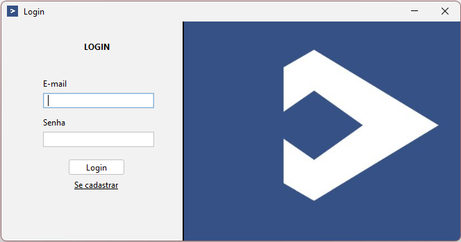
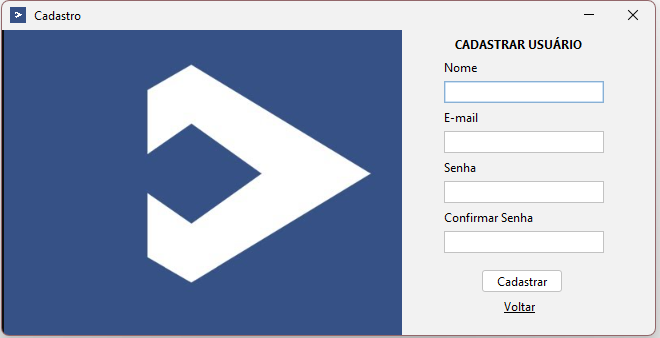
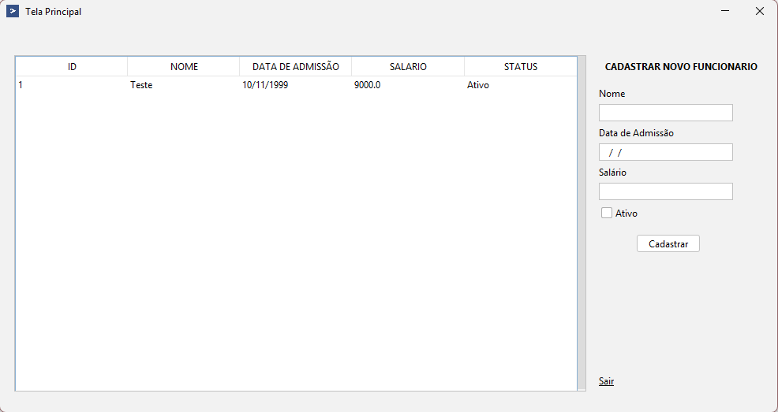

# Gestão de Funcionários

CRUD em Java Swing com autenticação e cadastro de funcionários, usando PostgreSQL via Docker.

## Funcionalidades

- Cadastro e login de usuários (senha com SHA-256)
- Cadastro de funcionários (nome, data de admissão, salário, status)
- Listagem em JTable
- Criação automática das tabelas na inicialização

## Stack

Java 17 · Swing · FlatLaf · PostgreSQL · JDBC · Maven · Docker

## Como rodar

```bash
docker compose up -d na pasta raiz do projeto
abrir o projeto no netbeans e executá-lo
```

Para parar o banco: `docker compose down`

## Arquitetura

```
view → service → repository → PostgreSQL
```

- **view** — telas Swing
- **service** — regras de negócio e validações
- **repository** — acesso a dados via JDBC
- **model** — entidades
- **connection** — conexão e criação do schema

## Prints das telas





## Estrutura do banco

**usuarios** — id, nome, email (unique), senha (SHA-256)

**funcionarios** — id, nome, data_admissao, salario, status

## Notas
- O Service/Repository já implementam `atualizar` e `deletar`, prontos para uso futuro. A UI do teste cobre apenas cadastro e listagem, conforme o enunciado.
- Credenciais do banco estão fixas em `Conexao.java` apenas para facilitar a avaliação. Em produção, usaria variáveis de ambiente.
- Ficou meio tortinha a logo porque não achei na internet um exemplo bom :(